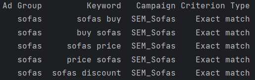

# Generating Keywords for Google Ads
Generating dataset of keywords for Google ad based on two given lists.

1. List of words like products (in this case furniture)
2. List of words desired to search for (in this case cheap, promotions etc.)

The dataset is saved into csv file.

Final dataset example:

